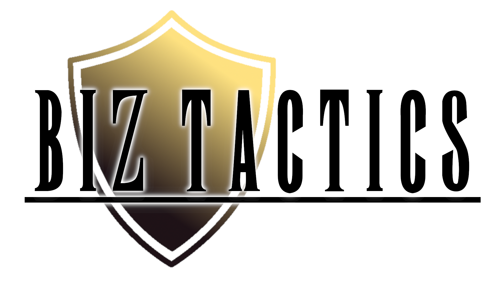

Un Tactical-RPG au tour par tour.

## Cadre du projet

Nous avons choisi le 5ème problème, le jeu de plateau, où l'objectif est de simuler un combat entre deux entités. Le style du TRPG s'est imposé naturellement à la lecture de l'énoncé, comme combat entre deux joueurs manipulant des tableaux 2D.

## Cahier des charges

Sur une grille, chaque joueur contrôle plusieurs personnages tour à tour. Chaque personnage a des caractéristiques différentes. Le premier joueur qui a éliminé les personnages de l'adversaire gagne.

A chaque tour, le joueur prend le contrôle d'un des personnages (dans un ordre défini au début du jeu). Ce personnage peut effectuer 2 actions: se déplacer, puis attaquer un personnage adverse ou se défendre.

La carte présentera des obstacles limitant le déplacement, et des objets à récupérer (en bonus).

Nous utiliserons Swing et AWT pour l'affichage graphique et la gestion des évements. Deux composants principaux: la carte de jeu, sous forme de grille, et une boite de texte en dessous pour afficher diverses informations.

Le contrôle du jeu est fait à la souris principalement, pour le choix de la case de déplacement, l'attaque etc.

## Répartition du travail

- Zac: Classes de personnages, attaques
- Louis: Input, affichage
- Matias: Gestion du jeu

### Inspirations

Gameplay librement inspiré de la série Fire Emblem, de Final Fantasy Tactics...

## Planification

La date de rendu est le 3 Juin 2019, ce qui nous laisse un mois de développement environ, à compter du 29 Avril.

### Planning prévisionnel général
Ecrit au 29/04
- Semaine du 29/04 : Rédaction du cahier des charges, organisation du code et des tâches.
- Semaine du 06/05 : Début du développement, chacun crée ses classes de son côté.
- Semaine du 13/05 : Relier les différentes classes, pour avoir un premier prototype fonctionnel.
- Semaine du 20/05 : Chargement de maps (bonus), des types de personnage, interactions entre personnages.
- Semaine du 27/05 : Peaufinage, réglage des détails, début et fin du jeu

### Bilans hebdomadaires
- Semaine du 29/04 au 05/05
    - Rédaction du Cahier des charges
    - Ecriture des classes relatives aux personnages et joueurs
    - Mise en place de l'affichage avec des images, détection du survol et du clic
    - Gestion du gameplay, des tours de jeu, fonctionnement général
- Semaine du 06/05 au 12/05
    - Chargement des caractéristiques de personnage et maps depuis un fichier JSON en ressources
    - Passage du jeu sous Gradle
    - Amélioration du jeu: détection d'obstacles, calculs de chemins
    - Détails graphiques: Barres de vie
    - Fin du jeu

## Organisation du code

```
.
└── main
    ├── java                                // Contient tout le code du jeu
    │   └── com
    │       └── zrpg
    │           ├── GameManager.java        // Gestion du jeu, prise en main des évenements
    │           ├── Launch.java             // Lancement du jeu
    │           ├── characters              // Caractéristiques des joueurs et personnages
    │           │   ├── PblCharacter.java   // Personnage jouable
    │           │   └── Player.java         // Classe attachée à un joueur, conteneur pour les personnages
    │           ├── display                 // Gestion de l'affichage
    │           │   ├── ColorLib.java       // Outil de chargement de couleurs
    │           │   ├── Display.java        // Déclaration de la fenêtre
    │           │   ├── ImgLib.java         // Outil de chargement d'images
    │           │   └── MapDisplay.java     // Canvas de jeu
    │           └── jsonloaders             // Classes utilisées pour la dé-serialization de fichiers JSON
    │               ├── BackgroundLoader.java
    │               └── CharLoader.java
    ├── resources                           // Ressources images, JSON
    │   ├── Background
    │   │   ├── grass.png
    │   │   ├── grass2.png
    │   │   ├── rock.png
    │   │   ├── rock2.png
    │   │   └── rock3.png
    │   ├── Chars
    │   │   ├── Bard
    │   │   │   ├── attack.png
    │   │   │   ├── idle.png
    │   │   │   └── stats.json
    │   │   .
    │   │   .
    │   │   .
    │   │   └── Witch
    │   │       ├── attack.png
    │   │       ├── idle.png
    │   │       └── stats.json
    │   ├── Imgs
    │   │   └── Logo.png
    │   └── maps.json 
        └── scripts                             // Scripts de lancement du jeu
            ├── start.bat                       // Script Windows, lancé par le task Play de Gradle
            └── start.sh                        // Script UNIX, non utilisé pour le moment
```

## Lancement du jeu

Windows
```bash
./gradlew play 
```

Unix
```bash
./play.sh
```

## Credits
Character sprites from [Pixel Champions Micro Edition](https://chimericalbard.itch.io/pixel-champions)

Map tileset from [Mozilla's Browser Quest](https://github.com/mozilla/BrowserQuest)


## Todo

Objectifs à court ou moyen terme

- Equilibrage du jeu
- Dessin de nouvelles maps